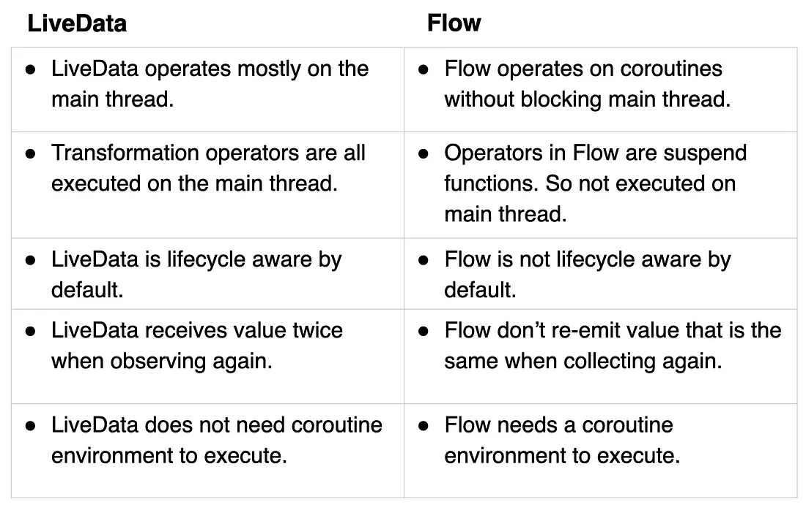

## Kotlin
Kotlin is a cross-platform, statically typed, general-purpose high-level programming language with type inference.

### Statically Typed
> Statically typed means that we've to explicitly define the type of the variable during the compilation phase of the program.
```kotlin
var num: Int = 0
```

### Type inference
> Type inference is a feature that allows compilers to automatically deduce the type of the variable without explicit type annotation.
```kotlin
var num = 0 // will automatically be infered to type Int
```

### Elvis operator
> `?:` is called elvis operator in kotlin, It provides concise way to handle nullable expressions. It returns LHS if expression is not null otherwise RHS.
```kotlin
var age: Int? = null
val isValid = age ?: false
```

### Safe Call operator
> `?.` is called safe call operator in kotlin, It is used for nullable types. If we use safe call on a nullable object, than the property or method will only be called when the object is not null.
```kotlin
val car: Car? = null
car?.start()
```

### Null Assertion operator
> `!!` is called null assertion operator in kotlin, It is used for nullable types when the user wants to assert nullable values. It will throw `NullPointerException` if the value is null.
```kotlin
val name: String? = nulL
print(name!!) // NullPointerException thrown
```

### Constructor
> Constructors are special methods used to initialize objects when they are created. In kotlin there are 2 types of constructor primary and secondary.
```kotlin
class Person(val name: String) {
	var age = 0
	constructor(name: String, age: String): this(name) { 
		this.age = age 
	}
}
```

### Initialization block
> `init` blocks are used to execute code during the time of object initialization. It is called after primary constructor.
```kotlin
class Person(val name: String) {
    init {
        println("Person created: $name")
    }
}
```

### sealed class
> Special type of class in kotlin that represents restricted hierarchy. Only classes in the same file can inherit from sealed classes.
```kotlin
sealed class Result {
	data class Success(val score: Int): Result
	data class Failure(val punishment: String): Result
}
```

### data class
> Special type of class in kotlin used to store data, It automatically generate methods like `toString`, `get`, etc..
```kotlin
data class Person(val name: String, val age: Int)
```

### abstract class
> Classes that contains abstract property and methods that must be initialized by the child classes. It can contain both concrete and abstract methods.
```kotlin
abstract class Animal {
	abstract val legs: Int
	abstract fun walk()
}
```

### Interface
> It is like contract for classes that they must implement. Interface contains abstract methods and properties that must be defined by the classes implementing it. A class can implement multiple interfaces.
```kotlin
interface Sense {
	fun smell()
	fun talk()
	fun walk()
}
```

### companion object
> Special object declared within the class that allows you to directly access property and function defined in it using class name. It is like static methods of Java.
```kotlin
class Hello {
	companion object {
		val name  = "sidharth"
	}
}
// Hello.name
```

### lateintit keyword
> Used with mutable non nullable properties, Tells compiler that the property will be initialized before usage.
```kotlin
lateinit var name: String
name = "Raju"
```

### lazy keyword
> Used with immutable nullable as well as non nullable property, Generally used for properties that are computationally expensive. It takes an lambda function as parameter and returns a `lazy` instance. The propery will only be initialized when the property is accessed first time.
```kotlin
val password: String by lazy {
	getPassword()
}
```

### Backing Field
> A backing field in Kotlin is a field that is automatically created by the compiler for a property that does not have a custom getter or setter
```kotlin
// var first name: String will generate default getter and setter
var first name: String
		get() = name
		set(value) { name = value }
```
### IntArray vs Array<<a>Int>
> intArray is of type int[] while Array is of type Integer[], There is no boxing in case of intArray as it directly translates to java primitive array.

### Reified
> [explanation with example](https://stackoverflow.com/a/66801688/16177121 "explanation with example")

### Boxing
> process of conveting a primitive data type to its wrapper class. The opposite is called unboxing.
```kotlin
val x: Int = 1
val x: Integer = x //boxing will take plave
```

### Scoped function
> Special type of function in kotlin that define a specific scope in which we can operate on the object.

[Explanation](https://stackoverflow.com/a/45978893/16177121)

### suspend function
> Functions that are used to perform asynchronous tasks, They do no block the main thread and can be paused and resumed at later time. They can only be called using suspend functions or from Coroutine.
```kotlin
suspend fun download()
```

### JvmStatic, JvmField, and JvmOverloads
> `@JvmStatic` is used to expose companion object members as static members in Java.
>
> `@JvmField` is used to expose a Kotlin property as a Java field. This is particularly useful when you want to directly access a property without invoking its getter method from Java.
> 
> `@JvmOverloads` is used in Kotlin to instruct the compiler to generate multiple overloads for functions with default parameters. 
```kotlin
> @JvmOverloads
fun myFunction(a: Int = 1, b: Int = 2, c: Int = 3) {
    println("a: $a, b: $b, c: $c")
}
// you can call myFunction from Java with any number of arguments (from 1 to 3), and Kotlin generates the necessary overloads.
```

### Coroutine
> Feature in programming languages that allows you to write asynchronous, non-blocking code in a sequential and synchronous manner.
> Light-weight threads, multiple coroutines can be scheduled to be executed on the same thread

#### Dispatchers
> responsible for determining which thread the coroutine will run on.
> - **Dispatchers.Default:** Suitable for CPU-intensive work.
> - **Dispatchers.IO:** Suitable for I/O-bound work, like network or database operations.
> - **Dispatchers.Main:** Typically used in Android applications for UI operations. It represents the main thread of the application.
> - **Dispatchers.Unconfined:** Starts the coroutine in the caller thread, but later resume in the appropriate dispatcher.

#### Scope
> Provides a context for coroutines, allowing you to control their lifecycle. Scopes are essential for managing the lifetime of coroutines, ensuring they are canceled when they are no longer needed to prevent memory leaks.
> - **GlobalScope:** It is not bound to any specific part of your code and lives as long as your application is running. 
> - **CoroutineScope:** . Tied to a specific part of your application, like an activity or a fragment. When the component is destroyed, all coroutines in its scope are automatically canceled.

#### Builders
> Used to launch coroutines, These builders start a new coroutine in the specified scope and context.
> - `launch` launches a new coroutine and returns a Job object representing the coroutine. The coroutine runs concurrently with the rest of the program.
> - `async` async is used when you want to perform a computation asynchronously and return a result. It returns a Deferred object that, You can use await() on the Deferred object to get the result.
> - `runBlocking` used to start a new coroutine and blocks the current thread until the coroutine completes.
> - `withContext` used to switch the coroutine's context. It allows you to switch to a different dispatcher or thread for the duration of the provided lambda expression.
> - `coroutineScope` used to create a new coroutine scope. It is similar to runBlocking but does not block the current thread. It suspends the coroutine and allows other tasks to run concurrently.

##### a "deferred" typically refers to an object or concept that represents the result of a computation that might not be available immediately

### Flows
> Stream of data that can be computed asynchronously. Like LiveData and RxJava flows allow observer like pattern meaning collectors get notifies everytime there is change in source.

#### 3 entities of flows
> - **Producer -** produces data that is added to stream
> - **Intermediaries (optional) -** can modify each value emitted to stream, or stream itself without consuming the values.
> - **Collector -** that consumes the emitted values.

#### Components & Lifecycle
##### Components
> Flows follows Consumer & Producer pattern.
```
public interface Flow<out T> {
    public suspend fun collect(collector: FlowCollector<T>)
}

public fun interface FlowCollector<in T> {
    public suspend fun emit(value: T)
}
```

##### Lifecycle
> - **Launching**
> A coroutine launches on the Dispatcher we transmitted to CoroutineScope. After that, the following steps take place: Flow Creation, Operators Collection & Data Emission. The final result will be processed on the transmitted Dispatcher.
> - **Flow creation**
> Operators are created from top to bottom on the current execution thread. (Similar to the Builder pattern.)
> - **Operators collection**
> Performed from the bottom up. Each operator collects the upper one
> - **Data emission**
> Starts when all operators have successfully called collect at the top stream. Goes from the top down.
> - **Cancellation/Completion**.
> Execution cancelled/Completed

#### Types
> - **Cold Flow -** It does not start producing values until one starts to collect them. It can have only one subscriber. e.g. flow
> - **Hot Flow —** It will produce values even if no one is collecting them. e.g. StateFlow, SharedFlow

#### Commonly Used Operators
> - **Terminal Operators —** They may signal completion of the stream or provide a way to collect or consume the elements emitted by the stream. e.g. collect
> - **Intermediate Operators —**  Intermediate operators transform the elements emitted by the stream or flow into new streams or modified values. e.g. map, filter.

#### Flows vs LiveData
> 

#### Stateflow
> - It is a hot flow.
> - Needs an initial value.
> - only emitted value is last known value.
> - can be created using `MutableStateFlow<>()`
> - value property allows us to check the current value.
> - does not emit consecutive repeated values. When the value differs from the previous item, it emits the value.

#### Sharedflow
> - It is a hot flow.
> - does not need an initial value.
> - can be created using `MutableSharedFlow<>()`
> - there is no value property.
> - emit value even if consecutive values are same.
> - useful for broadcasting events that happen inside an application to subscribers that can come and go.

#### collect & collectLatest
> `collect` is used to sequentially collect emitted values from a flow.
> `collectLatest` cancels the previous collection coroutine when a new value is emitted, ensuring only the latest value processing is active.

#### stateIn and shareIn
> - shareIn and stateIn operators convert cold flows into hot flows.
> - The shareIn operator returns a SharedFlow instance whereas stateIn returns a StateFlow.

##### shareIn
> stateIn contains 3 parameters scope, started and initialValue.
> - **scope:** the coroutine scope to define.
> - **started:** SharingStarted strategy
> 	- **Eagerly:-** Sharing is started immediately and never stops.
> 	- **Lazily:** Sharing is started when the first subscriber appears and never stops.
> 	- **WhileSubscribed:** Sharing is started when the first subscriber appears, immediately stops when the last subscriber disappears (by default), keeping the replay cache forever (by default).
> - **initialValue:** initial value.
```
val stateFlow: StateFlow<SomeState> = someFlow
    .stateIn(
        scope = viewModelScope,
        started = SharingStarted.WhileSubscribed(5000),
        initialValue = someInitialValue,
    )
```

##### stateIn
> shareIn contains the same three parameters as stateIn, but instead of initialValue, it has a replay parameter.
> - **replay:** how many times to emit the value
```
val sharedFlow: SharedFlow<SomeState> = someFlow
    .shareIn(
        scope = viewModelScope,
        started = SharingStarted.WhileSubscribed(5000),
        replay = 1,
    )
```

#### Flow Builders
##### flowOf
```
flowOf(4, 2, 5, 1, 7)
.collect {
    
}
```
##### asFlow
```
(1..5).asFlow()
.collect {
    
}
```
##### flow
```
flow {
    (0..10).forEach {
        emit(it)
    }
}.collect {
    
}
```
##### channelFlow
```
channelFlow {
    (0..10).forEach {
        send(it)
    }
}.collect {
    
}
```

#### flowOn
> flowOn Operator allows to control the thread on which the task will be done.
```
val flow = flow {
    (0..10).forEach {
        delay(500)
        emit(it)
    }
}
.flowOn(Dispatchers.Default)
```
